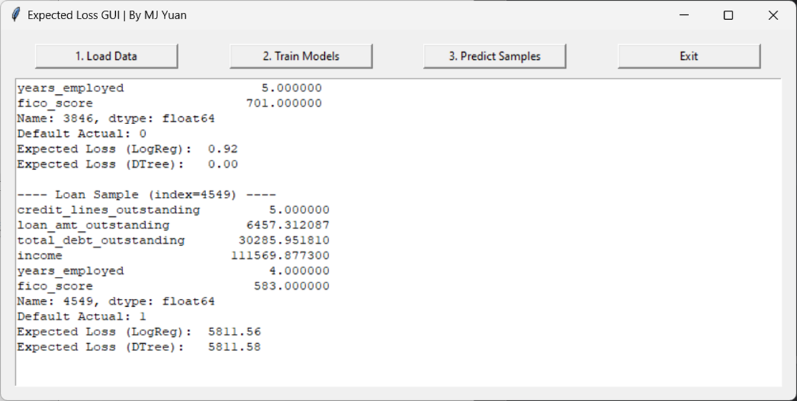

# Expected Loss GUI

A simple Tkinter-based desktop application that demonstrates how to load loan data from a CSV file, train machine learning models (Logistic Regression and Decision Tree) to predict default probabilities, and calculate the expected loss on loans. The GUI guides you through loading data, training models, and predicting outcomes on random samples.



## Features

- **Data Loading**:  
  Load a CSV file containing loan data. The application displays the first few rows to verify that the data was loaded correctly.
  
- **Model Training**:  
  Train two machine learning models (Logistic Regression and Decision Tree) on the provided dataset to predict loan defaults. The application evaluates and displays the AUC (Area Under the ROC Curve) for each model.
  
- **Expected Loss Prediction**:  
  Calculate the expected loss for random loan samples using the formula:
  \[
  \text{Expected Loss} = \text{PD} \times \text{LGD} \times \text{Loan Amount Outstanding}
  \]
  where LGD (Loss Given Default) is set to 90% (based on a recovery rate of 10%).
  
- **User-Friendly GUI**:  
  A clean, button-driven interface with a text output window to show logs and results. Users can load data, train models, predict outcomes, and exit the application using intuitive controls.

*Note: Ensure that `screenshot.png` is placed in the root directory of the project or adjust the path in this README accordingly.*

## Requirements

- Python 3.x
- Tkinter (included with most Python installations)
- [Pandas](https://pandas.pydata.org/)
- [NumPy](https://numpy.org/)
- [scikit-learn](https://scikit-learn.org/stable/)

Install the required Python packages using pip:

```bash
pip install pandas numpy scikit-learn
```

File Structure
```bash
ExpectedLossPredictor/
│── ExpectedLoss.py
│── README.md
│── Task 3 and 4_Loan_Data.csv
│── .gitattributes
│── screenshot.png
│── .venv/
```

## Usage

1. Run the Application:
- Execute the script from your terminal or command prompt:
```bash
python your_script_name.py
```
2. Load Data:
- Click on the "1. Load Data" button to open a file dialog and select your CSV file. The application expects the CSV to contain columns including:
  - credit_lines_outstanding
  - loan_amt_outstanding
  - total_debt_outstanding
  - income
  - years_employed
  - fico_score
  - default
- (Optionally, a customer_id column will be dropped if present.)

3. Train Models:
- After successfully loading the data, click on the "2. Train Models" button to train both the Logistic Regression and Decision Tree models. The output window will display the AUC scores for each model.

4. Predict Samples:
- Click on the "3. Predict Samples" button to randomly select 3 samples from the test dataset. For each sample, the application will display its features, the actual default value, and the expected loss computed using both models.

5. Exit:
- Click on the "Exit" button to close the application.

## Code Overview
1. GUI Components:
- Built using Tkinter with a simple layout featuring buttons for each operation and a text widget for log output.
2. Data Processing
- Uses Pandas to load and process CSV data.
3. Machine Learning Models:
- Utilizes scikit-learn to train a Logistic Regression model and a Decision Tree classifier.
- Models are evaluated using the ROC AUC score.
4. Expected Loss Calculation:
- For each loan sample, the expected loss is computed as:
  - Expected Loss=PD×LGD×Loan Amount Outstanding
- where LGD is set as 
1
−
Recovery Rate
1−Recovery Rate (with a default recovery rate of 10%).

## Acknowledgments
- Tkinter: For providing a simple yet powerful GUI toolkit for Python.
- Pandas & NumPy: For efficient data manipulation and numerical computation.
- scikit-learn: For robust machine learning model implementations.

